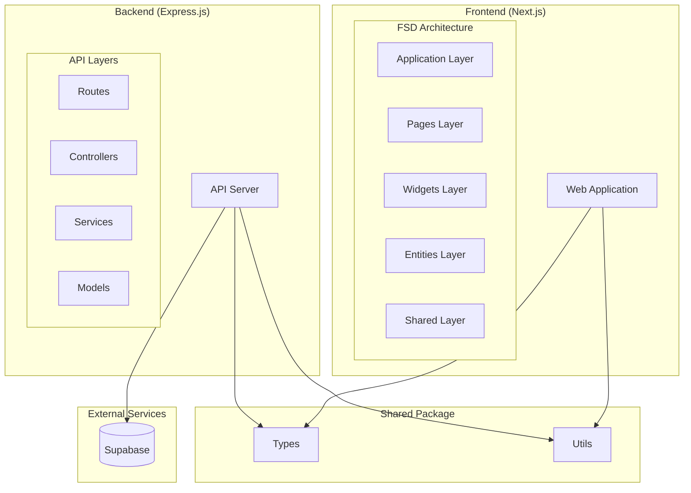
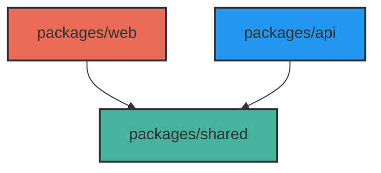
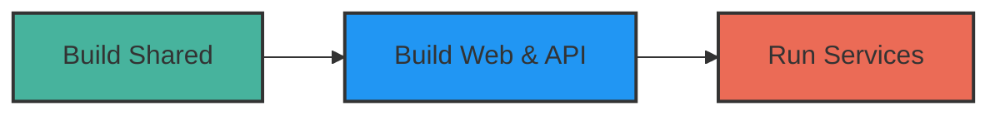

# Freedivah: Project Overview
**“From Dive Tracking to Social Sharing”**  
Freedivah is an interactive platform that allows freedivers to mark and share their dive locations on a global map using national flag icons.

The name 'Freedivah' combines 'freediving' with my identity as a developer, reflecting both my passion for underwater exploration and my journey.

## Key Features

- **Personalized Dive Map**: Pin and save your dive locations on a global map.
- **Sharing and Connecting**: Share your dive experiences and connect with divers worldwide.
- **Tracking and Documentation**: Log and track your dives across different countries to monitor your progress.
  
## Documentation
For more detailed information, refer to the following:
- [Technology Choices Rationale, API Specification, Functional Specification, Route Design etc](https://jiah827.notion.site/Project-Freedivah-10f4ef50e633807387d4c9307d622bdb?pvs=74)
- [Optimizing Freedivah’s Architecture with Feature-Sliced Design(FSD)](https://www.notion.so/jiah827/Optimizing-Freedivah-s-Architecture-with-Feature-Sliced-Design-1134ef50e63380b1b47bea0cc16f5f64)
- [Managing Shared Libraries: API Strategy with Exports and Aliases](https://www.notion.so/jiah827/exports-alias-API-1434ef50e63380a3aacad6eb9b7fec3b)
- [Why Vanilla Extract CSS?](https://www.notion.so/jiah827/CSS-1424ef50e633802ab39cec3730fe2d74)

## Development Considerations

### Flexible and Scalable Architecture
   - Single-direction dependencies and modularity.
   - Loosely coupled systems through separation and abstraction of business logic, UI, and side effects. 
  
## Architecture
### System Overview

### Package Dependencies

### Build Flow

### Package Overview
- `@freedivah/shared`: Core utilities and types
- `@freedivah/web`: Next.js frontend application
- `@freedivah/api`: Express backend server

## Technologies Used
   - **Frontend**: Next.js, TypeScript, Vanilla Extract
   - **Backend**: Node.js, Express.js, Supabase
   - **Testing**: Jest
   - **DevOps**: Github Actions, Docker, AWS

## How to Run
### Prerequisites
- Node.js 18+ 
- PNPM 9.14.1+

### Installation & Development
1. Clone the repository
   ```
   git clone https://github.com/f-lab-edu/Freedivah.git
   cd Freedivah
   ```
2. Install dependencies
   ```
   pnpm install
   ```
3. Start development
   ```
   pnpm dev
   ```
### Testing
   ```
   yarn test 
   ```
### Build
   ```
   yarn build
   ```

## Design


