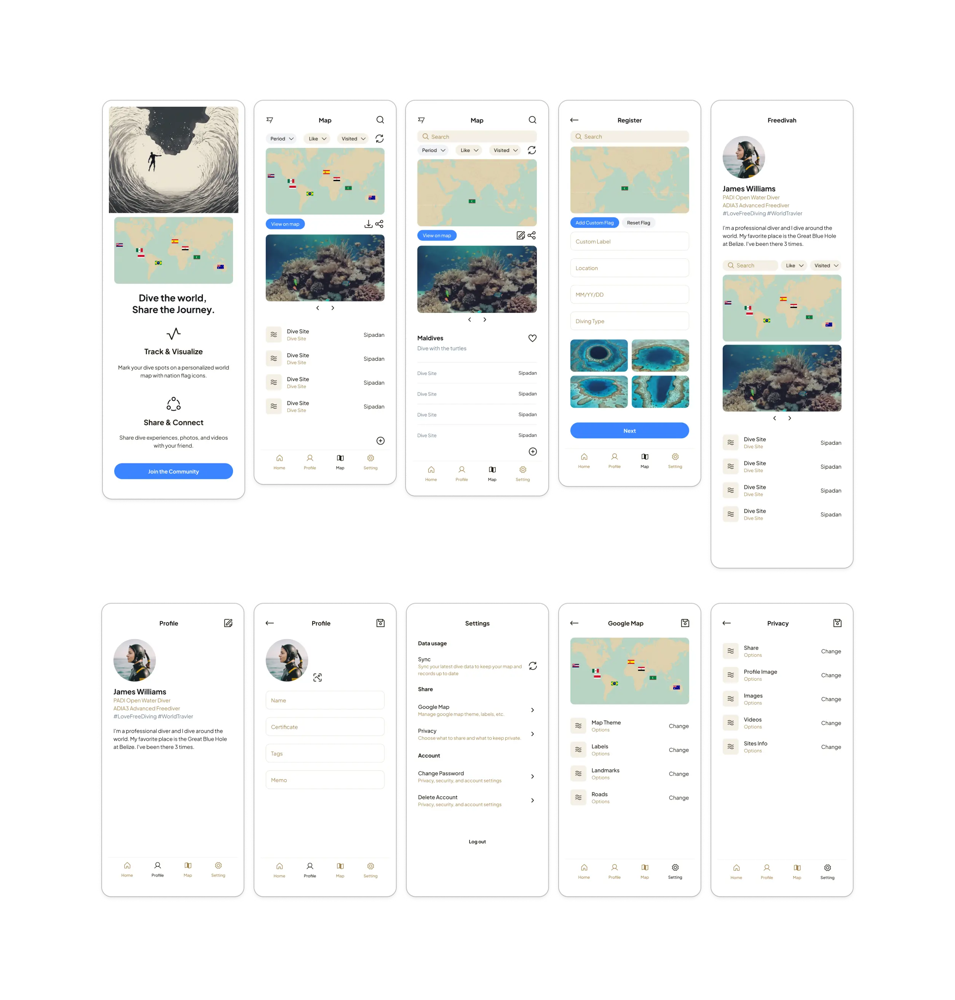

# Project Overview  
**“From Dive Tracking to Social Sharing”**  
Freedivah is an interactive platform for freedivers to mark and share their dive locations on a world map using national flag icons. It combines freediving with technology, allowing users to track their dives, create a personalized map, and connect with other divers.

The name 'Freedivah' blends 'freediving' with my identity as a developer, reflecting my journey and enthusiasm for underwater exploration.

## Key Features

- **Personalized Dive Map**: Users can mark their dive locations on a world map.
- **Sharing and Connecting**: Users can share their experiences and connect with other divers.
- **Tracking and Documentation**: Keep a record of dives across different countries.
  
## Documentation
For more detailed information, refer to the following:
- [Ideation MindMap, API Design, Functional Specification](https://jiah827.notion.site/Project-Freedivah-10f4ef50e633807387d4c9307d622bdb?pvs=74)
- [Optimizing Freedivah’s Architecture with FSD](https://www.notion.so/jiah827/Optimizing-Freedivah-s-Architecture-with-Feature-Sliced-Design-1134ef50e63380b1b47bea0cc16f5f64)
- [Managing Shared Libraries: API Strategy with Exports and Aliases](https://www.notion.so/jiah827/exports-alias-API-1434ef50e63380a3aacad6eb9b7fec3b)
- [Why Vanilla Extract CSS?](https://www.notion.so/jiah827/CSS-1424ef50e633802ab39cec3730fe2d74)

## Development Considerations

### 1. **Creating a "Screaming Architecture" from a Domain Perspective**
   - Domain-driven feature separation for clear, scalable architecture.  
   - Enables single-direction dependencies and modularity.

### 2. **Designing Decoupled Systems**
   - Clean separation of concerns between business logic, UI, and side effects.  
   - Applied SOLID principles for maintainable and flexible components.  
  
## Project Structure
```
packages/web/
├── app/               # Next.js App Router (Server Components)
│ └──  (routes)/       # URL-based routing, metadata management
│
├── src/               # FSD(Feature-Sliced Design) structure
│ ├── application/     # App-wide settings
│ ├── pages/           # Page composition
│ ├── widgets/         # Self-contained UI and functionality modules
│ ├── entities/        # Domain models and basic CRUD API
│ └── shared/          # Reusable modules
```
This structure combines Next.js App Router with Feature-Sliced Design (FSD) architecture to ensure:
- Clear separation between server and client components.
- Scalable, maintainable, and domain-driven architecture.

## Technologies Used
   - **Frontend**: Next.js, TypeScript, Vanilla Extract
   - **Backend**: Node.js / Express.js, Supabase
   - **Testing**: Jest
   - **DevOps**: Github Actions, Docker, AWS

## How to Run
### Prerequisites
- Node.js 18+ 
- Yarn 4.5.1+

### Installation & Development
1. Clone the repository
   ```
   git clone https://github.com/f-lab-edu/Freedivah.git
   cd Freedivah
   ```
2. Install dependencies
   ```
   yarn install
   ```
3. Start development
   ```
   yarn dev:web   // Run web application only
   yarn dev:all   // Run all services (web, api, shared)
   ```
### Testing
   ```
   yarn test      // Run all tests
   yarn test:coverage  // Run tests with coverage
   ```
### Build
   ```
   yarn build:all  // Build all packages
   ```

## Design



